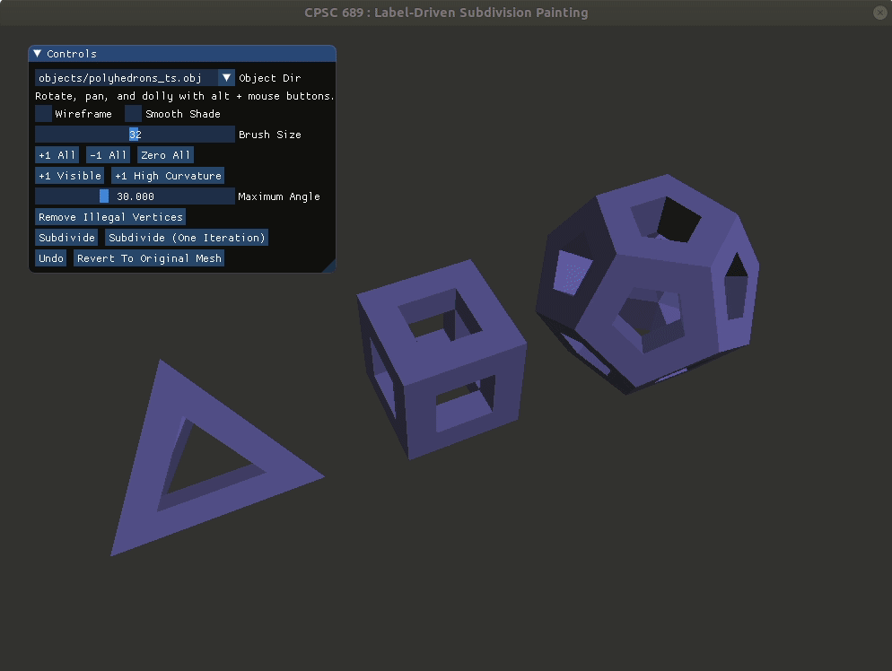

# Label-Driven Subdivision Painting

Label-driven aspect based on:  
["Adaptive Subdivision of Catmull-Clark Subdivision Surfaces."  
Yong, J.-H., & Cheng, F. (Frank). (2005).](http://cs.engr.uky.edu/~cheng/PUBL/Paper_adapt_sub.pdf)

I started with parts from the [OpenGL Superbible 7 Edition code](https://github.com/openglsuperbible/sb7code).

I used OpenGL (used a glsl v4.60 feature),
[dear imgui ](https://github.com/ocornut/imgui) (source included),
 and [OpenMesh libraries](http://www.openmesh.org/).

Write-up link here. 
